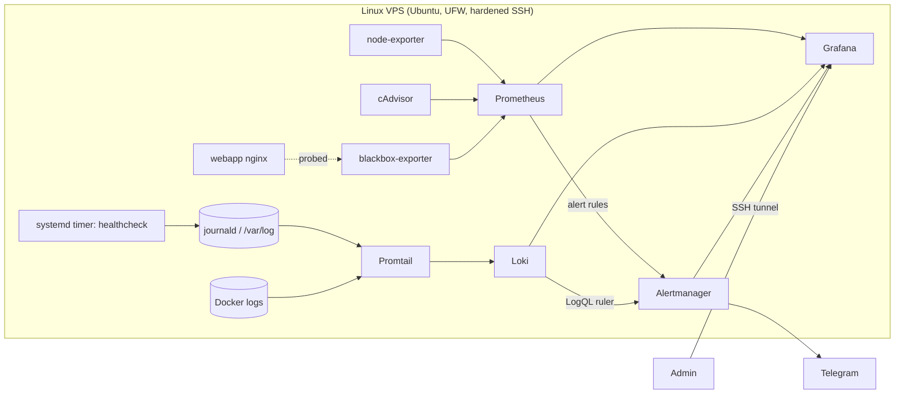

# Infrastructure Monitoring & Log Management – Personal Lab

Containerised monitoring and log management stack for a single Linux VPS, deployed with Docker Compose
and managed by systemd. Collects host and container metrics, ships host/container/journal logs,
alerts on resource thresholds and service availability, and routes notifications to Telegram.

## Architecture



| Component | Version | Role | Exposed on |
|---|---|---|---|
| Prometheus | 2.53 | Metrics TSDB, alert rule evaluation (15d retention) | 127.0.0.1:9090 |
| Alertmanager | 0.27 | Grouping, inhibition, routing to Telegram | 127.0.0.1:9093 |
| Loki | 3.1 | Log storage (TSDB schema v13, 7d retention) + LogQL ruler | 127.0.0.1:3100 |
| Promtail | 3.1 | Ships Docker, journald and /var/log logs | internal |
| Grafana | 11.2 | Provisioned datasources & dashboards | 127.0.0.1:3000 (configurable) |
| node-exporter | 1.8 | Host metrics + systemd unit states | internal |
| cAdvisor | 0.49 | Per-container metrics | internal |
| blackbox-exporter | 0.25 | HTTP availability probes | internal |
| webapp (nginx) | 1.27 | Sample workload to monitor | 127.0.0.1:8080 |

## Repository layout

```
docker-compose.yml          stack definition (pinned versions, memory limits, log rotation)
prometheus/                 scrape config + alert rules (host, containers, availability)
alertmanager/               routing template + Telegram message template
loki/                       Loki config + LogQL alert rules (ruler)
promtail/                   log collection: docker_sd, journal, /var/log
grafana/                    provisioned datasources and dashboards (as code)
blackbox/, webapp/          probe module config, sample nginx service
host/                       Linux host provisioning: users, SSH, UFW, Docker, journald, logrotate, systemd
scripts/                    config rendering, validation, healthcheck, test tooling
docs/logql-queries.md       LogQL query reference
```

## Deployment

Tested target: fresh Ubuntu 24.04 VPS, 2 vCPU / 4 GB RAM, logged in as root with an SSH key.

```bash
git clone https://github.com/catalin-trusca/infra-monitoring-lab.git && cd infra-monitoring-lab
cp .env.example .env && nano .env            # Grafana password, Telegram token/chat id

sudo ADMIN_USER=ops bash host/01-users.sh    # then verify: ssh ops@<vps> from a NEW terminal
sudo ADMIN_USER=ops bash host/02-ssh-hardening.sh
sudo bash host/03-firewall.sh
sudo ADMIN_USER=ops bash host/04-docker.sh
sudo bash host/05-logging.sh
sudo ADMIN_USER=ops bash host/06-install-stack.sh
```

Access Grafana through an SSH tunnel (nothing but SSH is open to the internet):

```bash
ssh -L 3000:127.0.0.1:3000 -L 9090:127.0.0.1:9090 ops@<vps>
# http://localhost:3000  -> Monitoring Lab folder
```

Day-2 operations:

```bash
make validate            # promtool / amtool / loki -verify-config / compose config
make reload-prometheus   # hot-reload rules after editing
sudo systemctl reload monitoring-stack
systemctl status monitoring-stack monitoring-healthcheck.timer
journalctl -u monitoring-healthcheck -n 20
```

## Metrics collection

- **Host** (node-exporter, mounted read-only at `/host`): CPU, load, memory, filesystems, disk I/O, network,
  plus systemd unit states for `ssh`, `docker`, `fail2ban`, `ufw` and the lab's own units (via D-Bus).
- **Containers** (cAdvisor): CPU, working-set memory vs. `mem_limit`, network, restarts.
- **Availability** (blackbox-exporter): HTTP probes against webapp, Grafana, Loki, Alertmanager, Prometheus.
- **Stack self-monitoring**: every component's own `/metrics` endpoint.

## Log ingestion

| Source | Promtail mechanism | Labels |
|---|---|---|
| Container stdout/stderr | `docker_sd_configs` via Docker socket | `container`, `service`, `stream` |
| systemd journal | `journal` scraper (persistent journald) | `unit`, `level` |
| auth.log, syslog, ufw.log, fail2ban.log | file tailing | `filename` |
| Healthcheck log (logfmt) | file tailing | `job=monitoring-lab` |

Queries are listed in [docs/logql-queries.md](docs/logql-queries.md).

## Alerting

| Alert | Source | Condition | Severity |
|---|---|---|---|
| HostExporterDown | Prometheus | `up{job="node"} == 0` for 1m | critical |
| HostHighCpuUsage | Prometheus | CPU > 85% for 10m | warning |
| HostHighLoad | Prometheus | load5 per core > 1.5 for 15m | warning |
| HostHighMemoryUsage | Prometheus | memory > 90% for 5m | warning |
| HostDiskSpaceLow / Critical | Prometheus | `/` free < 15% / < 5% | warning / critical |
| HostDiskWillFillIn24h | Prometheus | `predict_linear` over 6h < 0 | warning |
| SystemdUnitFailed | Prometheus | any monitored unit in `failed` | critical |
| SshServiceNotActive | Prometheus | `ssh.service` not active | critical |
| ContainerDown | Prometheus | not seen by cAdvisor for 60s | critical |
| ContainerRestarting | Prometheus | > 2 restarts in 15m | warning |
| ContainerHighCpuUsage / NearMemoryLimit | Prometheus | > 80% core / > 90% of limit | warning |
| EndpointDown / EndpointSlow | Prometheus (blackbox) | probe fails 2m / > 2s for 5m | critical / warning |
| ScrapeTargetDown | Prometheus | any target down 2m | warning |
| WebappHigh5xxRate | **Loki ruler** (LogQL) | 5xx ratio > 5% over 5m | warning |
| SshBruteForceSuspected | **Loki ruler** (LogQL) | > 20 failed logins in 5m | warning |

**Routing (Alertmanager):** alerts are grouped by `alertname` + `instance`.
Critical → Telegram with sound, repeat every 1h. Warning → Telegram silent, repeat every 12h.
Resolved notifications are sent for both.
**Inhibition:** `HostExporterDown` mutes all other alerts for the same instance;
`HostDiskSpaceCritical` mutes `HostDiskSpaceLow`.
Secrets are kept in `.env` (mode 600, git-ignored) and injected into `alertmanager.yml` at start-up by
`scripts/render-alertmanager.sh`.

### Testing the alert pipeline

```bash
make test-alert      # synthetic critical alert straight into Alertmanager
make traffic         # ~10% 5xx on webapp -> WebappHigh5xxRate after ~2-5 min
make stress          # 12 min of full CPU -> HostHighCpuUsage after 10 min
docker stop webapp   # -> EndpointDown + ContainerDown
sudo systemctl stop ssh   # (from the console only!) -> SshServiceNotActive
```

## Linux host administration

- **Users:** dedicated sudo user with key-only login, root password locked, admin added to `docker` group.
- **SSH hardening** (`/etc/ssh/sshd_config.d/10-hardening.conf`): no root login, no passwords,
  publickey only, `MaxAuthTries 3`, `AllowUsers`, idle timeout, no X11/agent forwarding,
  local forwarding kept for tunnels. The drop-in is named `10-` so it wins over cloud-init's `50-` file.
  Config is validated with `sshd -t` before restart. **fail2ban** bans IPs after 5 failures in 10 min.
- **Firewall (UFW):** default deny inbound, SSH rate-limited (`ufw limit`), Grafana optional.
  Docker-published ports bypass UFW, so every stack port is bound to `127.0.0.1` instead of relying on the firewall.
- **systemd:** `monitoring-stack.service` manages the Compose stack (start on boot, reload, clean stop);
  `monitoring-healthcheck.timer` runs an endpoint check every 5 minutes. A failed check fails the unit,
  which node-exporter exports and Prometheus turns into `SystemdUnitFailed`.
- **Log rotation:** Docker json-file driver capped at 10 MB × 3 per container (daemon + compose),
  journald persistent and capped at 500 MB / 14 days, logrotate policy for `/var/log/monitoring-lab/*.log`
  (daily, 14 rotations, compressed, size cap 20 MB).

## Lessons learned

- Docker and UFW: published ports are inserted into iptables `DOCKER` chains ahead of UFW rules.
- Loki label cardinality: keep status codes and IPs out of stream labels; extract them at query time.
- `for:` durations on alerts matter more than thresholds for avoiding flapping.
- Inhibition rules turn one outage into one notification instead of ten.

## Screenshots

`docs/screenshots/` – host overview dashboard, logs dashboard, Telegram alert.
